# VeriSight Sentinel

VeriSight Sentinel is an end-to-end deepfake and AI-generated content detection platform with a React frontend and Flask backend. It supports image, video, audio, and text scan workflows with model-based sensing, geo enrichment, persistence, and AI explanation.
Detect. Analyze. Explain. Protect.


## 📸 Project Interface Preview

### 1. Landing Page - 
The entry point of VeriSight Sentinel showcasing key features, awareness content, and call-to-action sections to guide users toward deepfake detection.

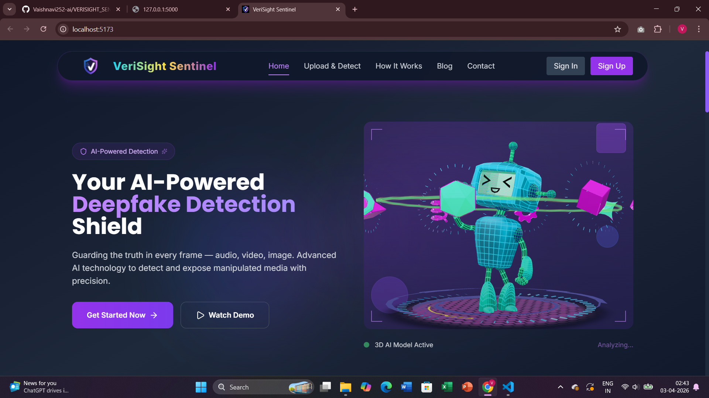

### 2. Uploading Page - 
Allows users to upload image, video, audio, text files with a clean drag-and-drop interface and preview before initiating AI-based detection.

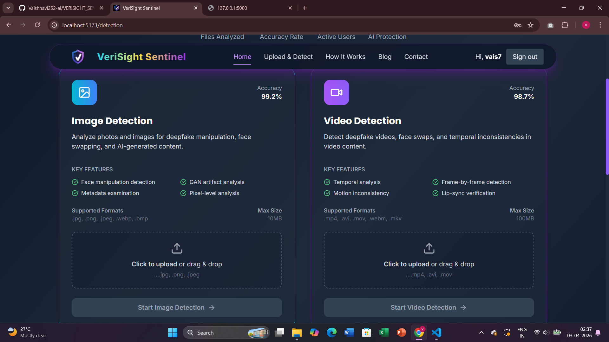
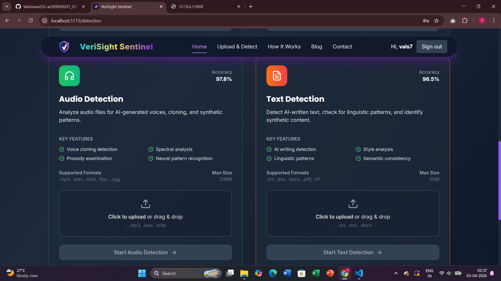


### 3. AI Literacy Mode - 
Provides detailed AI-generated insights including confidence score, visual artifacts, and reasoning behind classification (REAL or FAKE).

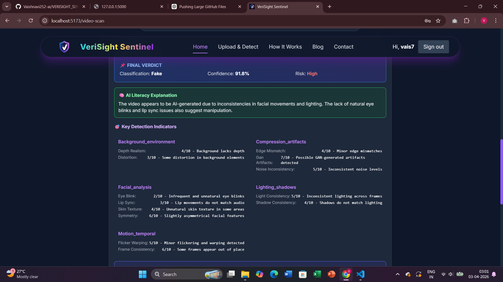


### 4. Report Content - 
Users submit structured reports with contextual details like platform, urgency, and location for further investigation by admins.

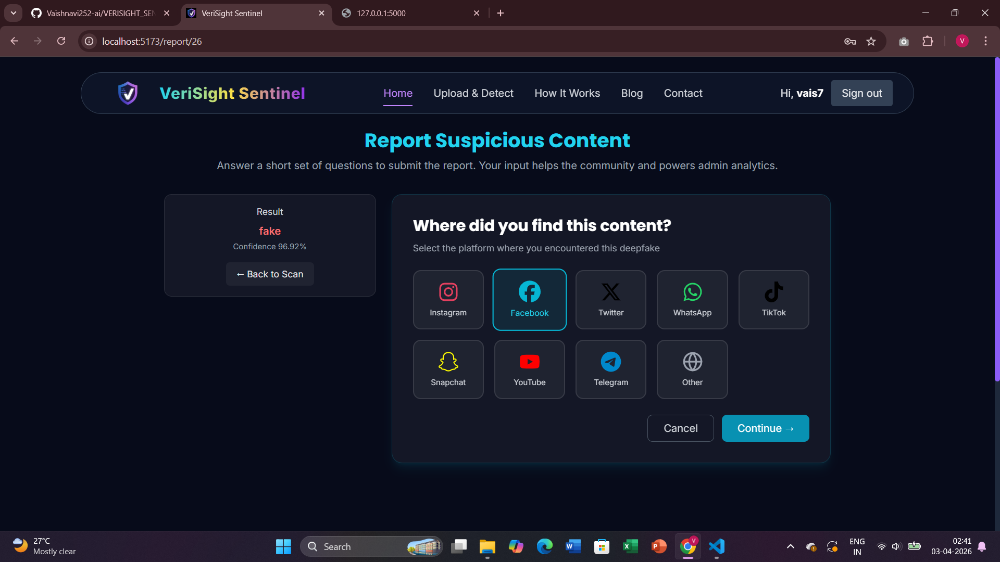


### 5. Admin Dashboard - 
Central dashboard displaying real-time analytics such as total detections, threat levels, and media distribution with live updates.

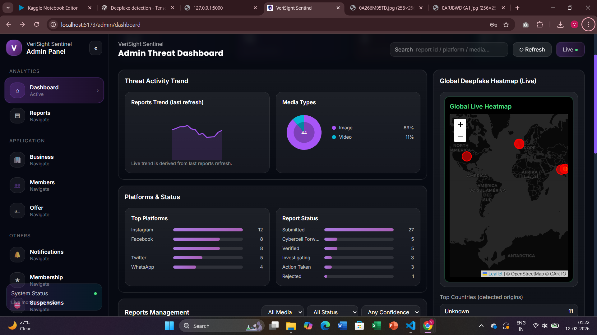


### 6. Admin Reports Section - 
Central dashboard displaying real-time analytics such as total detections, threat levels, and media distribution with live updates.

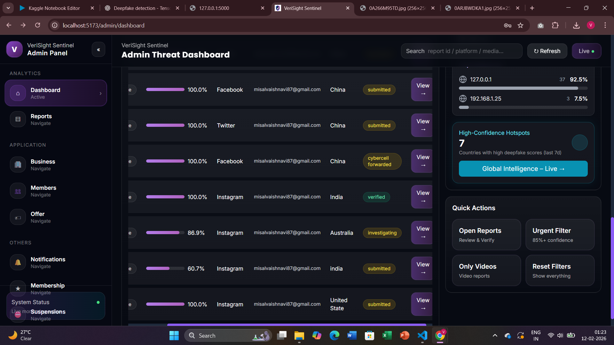
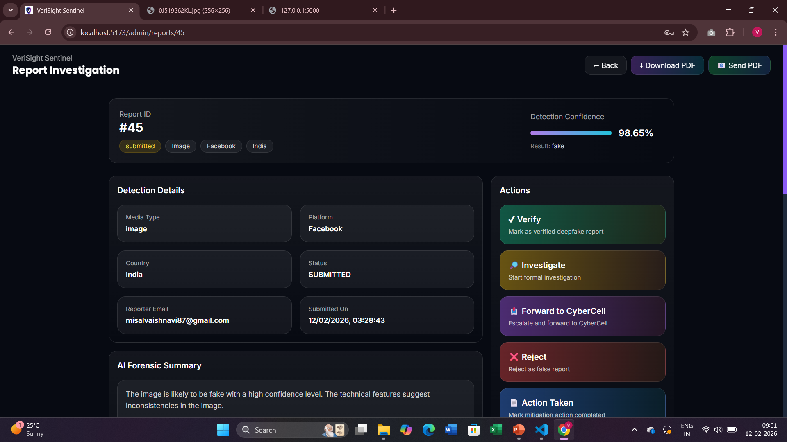


### 7. Global Heat Map - 
Visualizes real-time global deepfake activity using heatmaps, trends, and confidence indicators.

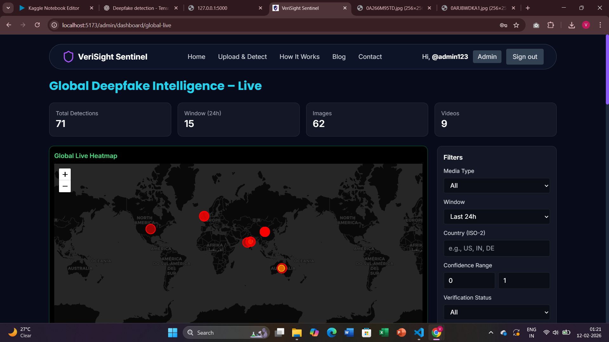
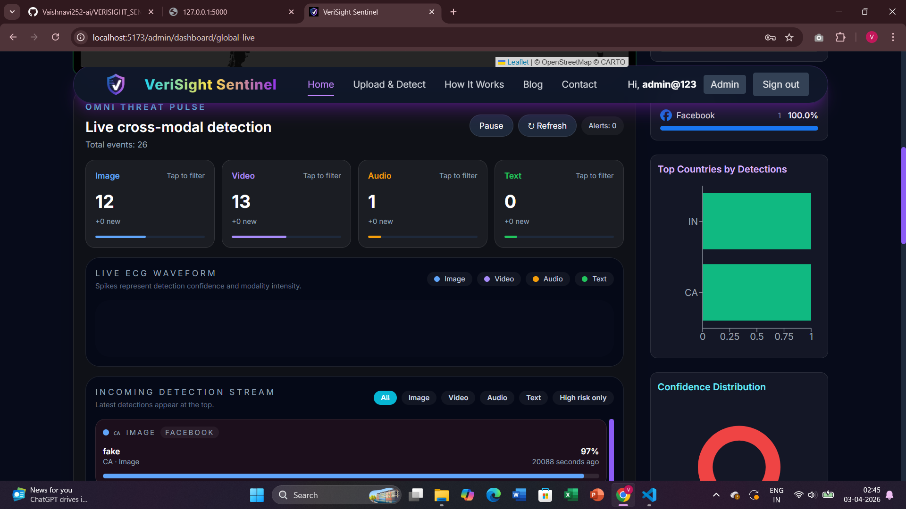


### 8. Analytical Page -
Advanced analytics dashboard presenting insights like top affected regions, detection trends, and AI-driven intelligence summaries. 

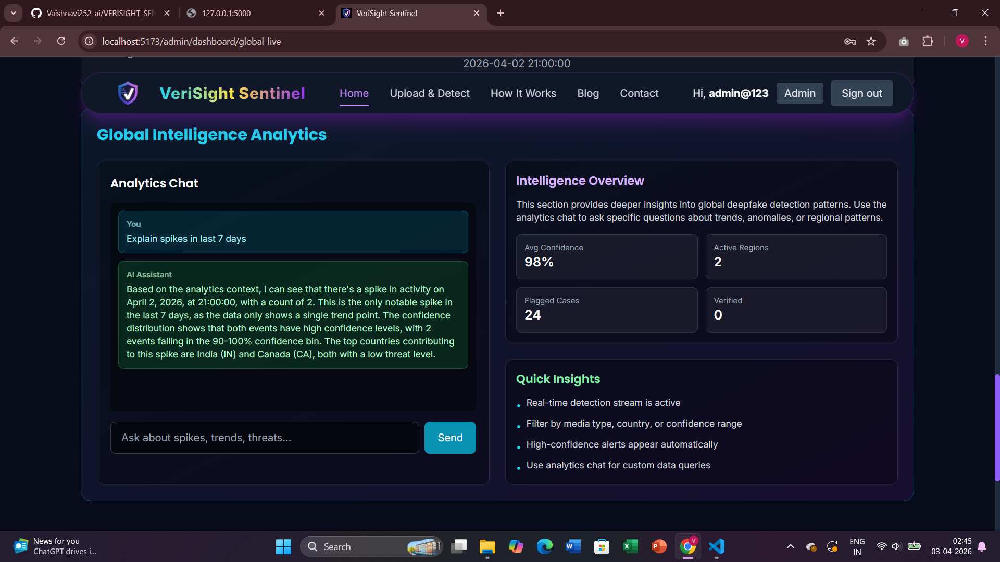


## 🚀 Features

- Multi-modal scan endpoints:
  - Image: `/api/image-scan`, `/api/image-explain`
  - Video: `/api/video-scan`, `/api/video-explain`, `/api/video-scan-url`, `/api/video-scan-history`
  - Audio: `/api/audio-scan` (similar pattern)
  - Text: `/api/text-scan` (similar pattern)
- Authentication with JWT cookies and role-based users (`Admin`, `User`)
- Email verification (`/api/auth/register`, `/api/auth/verify-email/<token>`)
- Reports and analytics endpoints
- **All-time analytics**: Charts and maps show cumulative data across lifetime, not just 24h or 7d
- **Location-based map filtering**: Click "View on Map" from a report to see all detections from that location with different IP addresses
- SQLite-based persistence using SQLAlchemy
- LLM-based narrative explanation via OpenAI/OpenRouter
- SSE stream for live detection dashboard updates
- Prebuilt testing seed data (admin/user + dummy detections)

## 📁 Repository structure

- `server/` - Flask backend application
  - `run.py` - entrypoint
  - `app/` - models, routes
  - `model/` - detection model wrappers, class mapping
  - `services/` - geo lookup, notification, LLM integration
  - `uploads/` - runtime upload destination for media
- `client/` - React (Vite + Tailwind) frontend
- `instance/` - (optional) initial data or backup
- `temp_backup/` - not tracked logic

## 🛠️ Tech stack

- Backend: Python, Flask, SQLAlchemy, JWT, Flask-CORS
- ML: TensorFlow/Keras model (`server/model/custom_model.keras`), torchvision, torch, OpenCV, mediapipe
- LLM: OpenAI/OpenRouter via `openai` SDK
- Frontend: React 19, Vite, Tailwind CSS, Recharts, Leaflet

## ⚙️ Prerequisites

- Windows 10/11 (Linux/macOS also works similarly)
- Python 3.10+ (venv recommended)
- Node.js 18+ (npm/yarn)

## 🧩 Setup backend

```bash
cd d:/Vaishnavi_Projects/Users/HP/VeriSight-Sentinal/server
python -m venv 
venv\Scripts\activate
python -m pip install --upgrade pip
pip install flask flask-cors flask-jwt-extended flask-sqlalchemy python-dotenv requests openai torch torchvision tensorflow keras opencv-python pillow mediapipe yt-dlp
# If you want the exact from requirements or extra helpers, add 
# pip install -r requirements.txt (ensure file uses UTF-8 encoding)
```

### Environment variables

Create `.env` in `server/` (example values):

```env
FLASK_SECRET=<secure>
JWT_SECRET=<secure>
DATABASE_URL=sqlite:///auth.db
RECAPTCHA_SITE_KEY=<site-key>
RECAPTCHA_SECRET=<secret>
SMTP_HOST=smtp.gmail.com
SMTP_PORT=587
SMTP_USER=<email>
SMTP_PASS=<password>
FROM_EMAIL=<email>
OPENROUTER_API_KEY=<api-key>
OPENROUTER_BASE_URL=https://openrouter.ai/api/v1
OPENROUTER_MODEL=meta-llama/llama-3.1-70b-instruct
OPENROUTER_REFERRER=https://verisight-sentinal.vercel.app
OPENROUTER_SITE_NAME=Verisight-Sentinal
# optionally OPENAI_API_KEY=<api-key> or LLM_API_KEY
```

### Backend run

```bash
python run.py
```

The app starts at `http://localhost:5000` and creates DB tables + seed data (`admin/admin123`, `user/user123`).

## 🧪 Setup frontend

```bash
cd d:/Vaishnavi_Projects/Users/HP/VeriSight-Sentinal/client
npm install
npm run dev
```

Default frontend URL: `http://localhost:5173`.

## 🔌 API Endpoints

### Auth
- `POST /api/auth/register` (body: {username,email,password,name,role})
- `POST /api/auth/login` (body: {username,password,role})
- `POST /api/auth/logout`
- `GET /api/auth/me` (JWT cookie required)
- `GET /api/auth/verify-email/<token>`
- `POST /api/auth/resend-verification`

### Config
- `GET /api/config` (recaptcha site key)
- `GET /api/health/llm`

### Image
- `POST /api/image-scan` (form-data image file)
- `POST /api/image-explain` (JSON: label, confidence, metrics, face_cues)

### Video
- `POST /api/video-scan` (form-data video file)
- `POST /api/video-explain` (JSON scan response)
- `POST /api/video-scan-url` (JSON {url})
- `GET /api/video-scan-history`
- `POST /api/video-scan-debug`

### Audio / Text / Reports / Analytics (similar)
- `POST /api/audio-scan`, `POST /api/text-scan`
- `GET /api/reports`, `POST /api/reports`
- `GET /api/analytics`, `GET /api/analytics-explain`

## 🗂️ Data persistence

- DB path: `sqlite:///auth.db` (default)
- models: `User`, `Detection`, `Report`, `ReportAnswer`
- file uploads: `server/uploads/{text,audio,videos}`

## 🧠 Deepfake models and heuristics

- Image model loader: `server/model/detect.py` loads `server/model/custom_model.keras` + `class_mapping.json`
- Fallback is random test data if model file missing
- Video model wrapper: `server/model/video_detect.py` (`model.pth`, `deepfake_model.h5` usage)

## 🧾 Notes / hardcoded credentials

- Seeds on first run: 
  - Admin user: `admin` / `admin123` (role Admin)
  - Standard user: `user` / `user123` (role User)
- Hardcoded admin override login in `api/auth` exists: `admin@123` / `Vaishu2004`.
- `.env` keys (Recaptcha, OpenRouter/OpenAI, SMTP) needed for full features.

## 🧹 Maintenance

- Stop server, migrate DB by deleting `auth.db` then rerun or use Alembic if added later.
- Keep `uploads` directory clean to avoid disk growth.

## 🧩 Deploy hints

- For production, set `JWT_COOKIE_SECURE=True`, `JWT_COOKIE_SAMESITE='Strict'`, secure secret keys.
- Use WSGI server (gunicorn/uwsgi) in place of `flask run`, e.g. `gunicorn run:app --bind 0.0.0.0:5000`.
- Use environment variable `DATABASE_URL` for PostgreSQL or MySQL in production.

## 🧾 Troubleshooting

1. **Import errors**: install missing Python packages in same venv.
2. **Model not found**: copy `server/model/custom_model.keras` and `class_mapping.json` into path.
3. **Corrupt DB**: remove `auth.db` and restart.
4. **LLM fails**: ensure valid `OPENROUTER_API_KEY`/`OPENAI_API_KEY` + matching base URL.

## 📌 Contribution

1. Fork repository
2. Create a branch: `git checkout -b feature/new-feature`
3. Implement and test
4. Commit and push
5. Open pull request

## 👩‍💻 Author

**Vaishnavi Misal**  
🎓 AIML Student | Full Stack Developer  
💡 Passionate about AI, Security & Scalable Systems  

- GitHub: https://github.com/Vaishnavi252-ai
- LinkedIn: www.linkedin.com/in/vaishnavi-misal-2bbb01291

## 📄 License   

MIT
